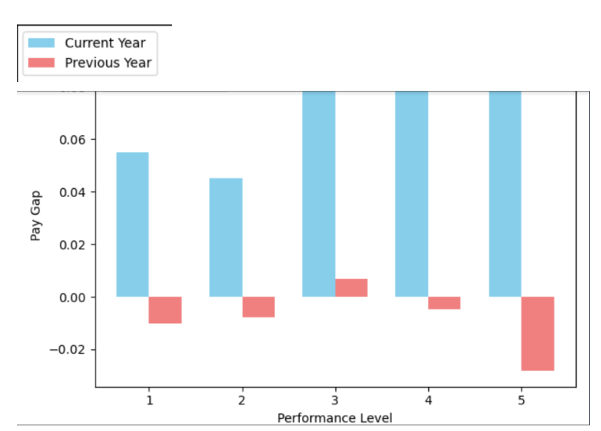

# Pay Equity Analysis Tool

## Overview
The Pay Equity Analysis Tool is a software designed to analyze payroll data sets spanning five years for any company, including the current year. It provides insightful visualizations and statistical analysis to help those companies understand, make informed decisions and address pay disparities within the organization. This not only fosters a fair workplace culture but also encourages the participation of all, regardless of their gender which positively impacts our society.

## Features
### Comprehensive Analysis:
Analyzes job distribution, pay distribution (displayed as a histogram), and various factors influencing pay such as gender, age, experience, performance score, and education.
### Gender Pay Gap Analysis:
Utilizes scatter plots to compare pay differentials between males and females when compared based on various aspects. 
Displays estimated pay gap percentage for the current year.
### Temporal Comparison:
Provides visualizations comparing pay gap differences between the current and previous years.
### Trend Prediction:
Utilizes linear regression models to predict future pay gap trends based on historical data.

## About the Data Set
The data set has been taken from glassdoor and focuses on income for various job titles based on gender. As there have been many studies showcasing that women are paid less than men for the same job titles, this data set will be helpful in identifying the depth of the gender-based pay gap. The features of the data set to be uploaded are:  Job Title : Depending on the company Gender : Male/ Female Age : from 18 onwards PerfEval :  Performance evaluation (ranges from 1 to 5) Education : Highest degree of education (High School, College, Masters, PhD)  Dept : Departments available in the company  Seniority : Seniority level (ranges from 1-5) Base Pay : Basic salary received Bonus : Extra salary received 

## Usage
Input - Upload payroll datasets for the current and past four years.
 Analysis - Run the software to generate insights and visualizations.
 Interpretation - Gain valuable insights into pay disparities and trends within the organization.
 Action - Utilize findings to implement strategies for addressing and mitigating pay inequalities.

## Import Requirements
Pandas
 Numpy
 Plotly
 Matplotlib
 Seaborn
 Scikit-learn
 Statsmodels
 Gradio 

## Points To Note
There are two .ipynb files:   
payEquitySoftware.ipynb :
Contains full project code including gradio module for user interface. The code for linear regression model (Pay gap trend prediction) utilises sklearn library only and not the one provided by OneAPI  (sklearnex)  RegressionModelOneAPI .ipynb:
Contains code for the linear regression model that has been employed for predicting the trend of pay gap using the extension for sklearn (sklearnex) provided by OneAPI.
The following graph depicts the comparison of pay gap on the basis of performance level

Here, the blue bars represent the positive value of pay gap, which means, on an average, men earn more than women for that year whereas some of the coral coloured bars represent the negative value of pay gap indicating that women earn more than men on the basis of performance level.

## Contributors
Vidisha Desai (@VidishaDesai)
 Lavanya Vasudevan (@LaviVasudevan)
 Aashika Jetti 

